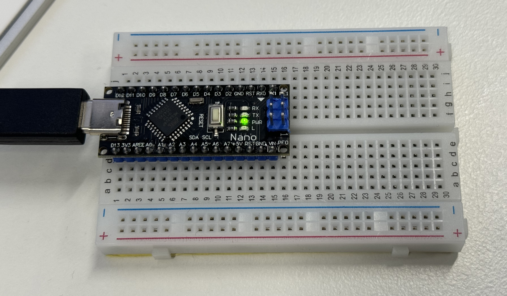

# ANU PHYS2020 Thermodynamics Course Arduino Quick Start Guide

Tony.Yan @anu.edu.au

March 2024

------

*This guide is to help you setup Arduino for data logging.*
*All source code is available at https://github.com/TonyXTYan/PHYS2020-Arduino-Quick-Start*
*The sample code will do basic data logging of provided components. We encourage you to extent and customise it to your project specific needs.*

*You should begin by completing the setup section, followed by the section about your specific sensors, and then finally to recording methods.*

> *For reference: I’m using macOS 14.4, Apple Silicon, Arduino IDE 2.3.2, Arduino Nano and various modules from Adrian.*

------

[TOC]

------

## Connecting to Arduino

First, you need to download Arduino IDE (integrated development environment) from https://www.arduino.cc/en/software. 

Once you have Arduino IDE installed, we can connect it to your computer and open the IDE. In the below picture, I have also mounted the Arduino Nano on a breadboard for later convent: 

Our Arduino Nano uses a USB Type-C connector, you can connect it to your computer with any Type-C cable and Arduino can be powered from Type-C. 

The Arduino IDE will preload a default BareMinimum screip (Menu -> File -> Examples -> Basic -> BareMinimum) so you can test your connections to your Arduino.

We first need to configure the IDE to our specific Arduino by clicking “Select Board”

and select "Arduino Nano" and its USB port. 

Then you can try to upload the BareMinimum script onto your Arduino by pressing the Upload icon (or Menu -> Sketch -> Upload or Cmd-U). 

You might experience the following error saying the programmer is not in sync

In that case, you need to go to Menu -> Tools -> Processor and select: **ATmega328P (Old Bootloader)**

Then try upload again and it should upload without error.

### *Other Common Issues/Troubleshooting:*

* Try different USB cable
* Try different USB port, avoid using adapters
* Try peer's Arduino

If there is other Arduino setting up issues, feel free to contact us.

### General Info and Tips about using Arduino in PHYS2020 Project

You might find the following Arduino Pin layout helpful (available at https://content.arduino.cc/assets/Pinout-NANO_latest.pdf)

* If you want to power the Arduino without connecting it to a computer, you can uses either
    * 6-20V unregulated external power supply (pin 30 VIN) e.g. a 9V battery.
    * 5V regulated external power supply (pin 27 +5V) e.g. provided breadboard power supply, you might prefer this if you want to use some high current modules such as a display. 
    * The power source is automatically selected to the highest voltage source. 
* In general disconnect ant unused components from the Arduino pin, some Arduino libraries will hardcode specific pins and send current through without warning. 
* Becareful about which voltage rail you are connecting the modules! Some module come with a built-in voltage regulator so you can connect them to either 3.3V or 5V, while some modules doesn't and have to be connected to 3.3V, otherwise they could be permanentally damaged. 
* [Arduino Official Documentation](https://docs.arduino.cc) and [Arduino Offical Forum](https://forum.arduino.cc) are usually good first places to look up for any issues.
* https://lastminuteengineers.com/electronics/arduino-projects/ provide extensive and detailed guide on Arduino modules, I strongly recommand a quick read to be familar of what's on there, espically if you want to go beyond the sample codes. (I've also stolen some figures from their website for educational purposes).

## MAX6675 (or MAX31855) Temperature Sensor

For more detailed guide on using the MAX6675 module, please read https://lastminuteengineers.com/max6675-thermocouple-arduino-tutorial/ 

The MAX31855 is the newer version MAX6675, but they work basically the same.

The kit includes 

* Type-K thermocouple probe 
    * M6 threads
    * measurement range 0-80ºC. TBC!
* MAX6675 breakout board, 
    * 12-bit ADC (analog to digical converter), 
    * temperature range 0-1024ºC with resolution of 0.25ºC (12-bit)
    * accuracy ±3ºC (however in my experience seen ±10ºC errors, so please check your probe is not faulty). 

The following table are the connections used in the sample code: 

| MAX6675 | Arduino |
| ------- | ------- |
| VCC     | 3.3V    |
| GND     | GND     |
| SCK     | D6      |
| CS      | D5      |
| SO      | D4      |

You also need to grab a code library to use MAX6675 module, go to Menu -> Sketch -> Include Library -> Manage Libraries, and search up MAX6675.
I used the library from Adafruit, but you're of course welcome to experiment with other ones.

### Tips & Tricks

* If you want to use multiple MAX6675 (or MAX31855) you can (should) let them share the same SO and CLK pins, and only need connect different CS pins to Arduino. 

## DS18B20 Temperature Sensor

## MPU6050 Accelerometer 

## Recording to Serial Console

By default, the 

## Recording Temperatures onto SD Card

