# ANU PHYS2020 Thermodynamics Course Arduino Quick Start Guide

Tony.Yan @anu.edu.au

March 2024

------

*This is a guide for setting up an Arduino for data logging.*
*All source code and this document is available at https://github.com/TonyXTYan/PHYS2020-Arduino-Quick-Start*
*The sample code will do basic data logging of provided components. We encourage you to extent and customise it to your project specific needs.*

*You should begin by completing the [Connecting to Arduino](#connecting-to-arduino), followed by the section about your specific sensors, then you could proceed to [Recording Data to SD Card](#Recording-Data-to-SD-Card)*. 

Note: the sensor sections from this guide are a TLDR versions from [Last Minute Engineers](https://lastminuteengineers.com/electronics/arduino-projects/ ), except some pin changes to integrate the SD card module for data logging. You're of course welcome to explore more. 

> *For reference: I’m using macOS 14.4, Apple Silicon, Arduino IDE 2.3.2, Arduino Nano and various modules from Adrian.*

------

[TOC]

------

## Connecting to Arduino

First, you need to download Arduino IDE (integrated development environment) from https://www.arduino.cc/en/software. 

Once you have Arduino IDE installed, we need to first verify the Arduino works, by connecting it to your computer and open the IDE. 

As illustrated in the figure below, I also strongly recommand mounting your Arduino Nano onto a breadboard, and connect the 5V and 3.3V to each power rails on the breadboard, this would make connecting various modules much simplier later.  

Our Arduino Nano uses a USB Type-C connector, you can connect it to your computer with any Type-C cable and Arduino can be powered from Type-C. 

The Arduino IDE will preload a default BareMinimum screip (`Menu -> File -> Examples -> Basic -> BareMinimum`) so you can test your connections to your Arduino.

We first need to configure the IDE to our specific Arduino by clicking `Select Board`

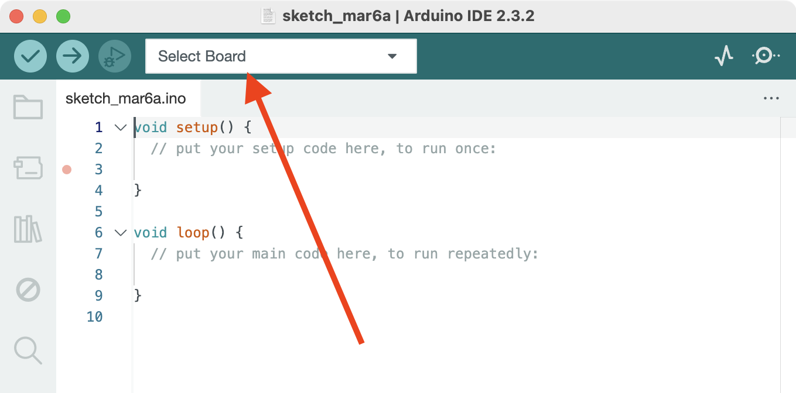

and select `Arduino Nano` and its `USB Serial Port`. 

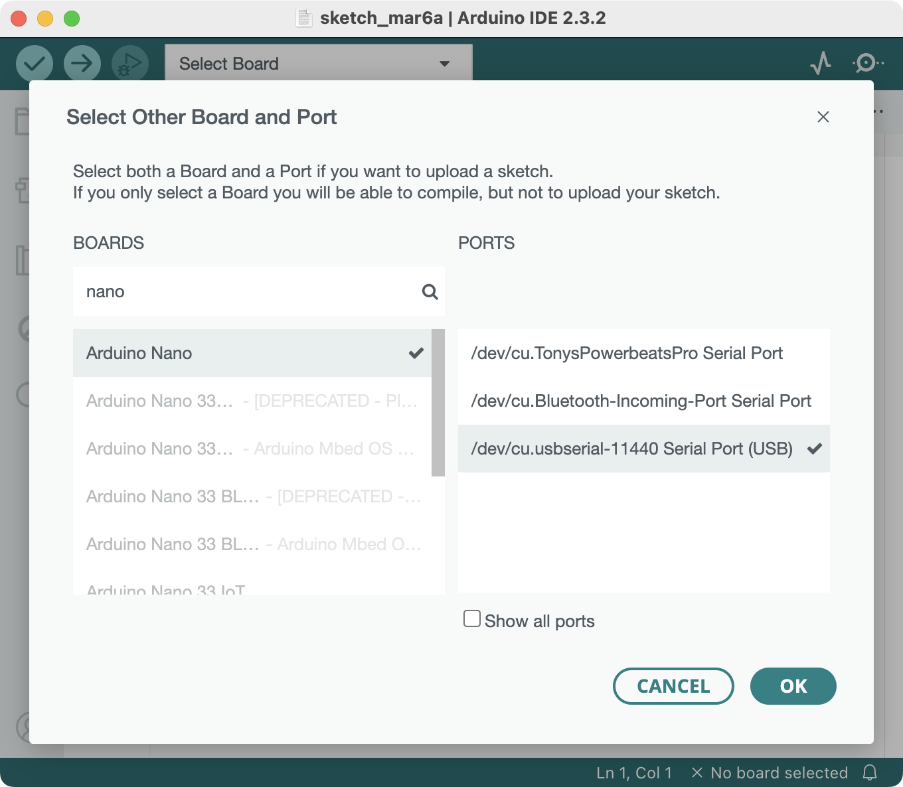

Then you can try to upload the BareMinimum script onto your Arduino by pressing the `Upload` icon (or `Menu -> Sketch -> Upload` or `Cmd-U`). 

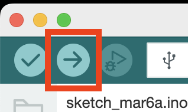

You might experience the following error saying the programmer is not in sync

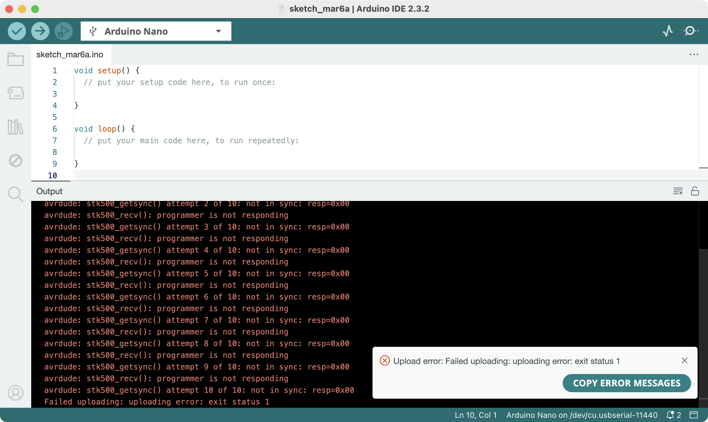

In that case, you need to go to Menu -> Tools -> Processor and select: **ATmega328P (Old Bootloader)**

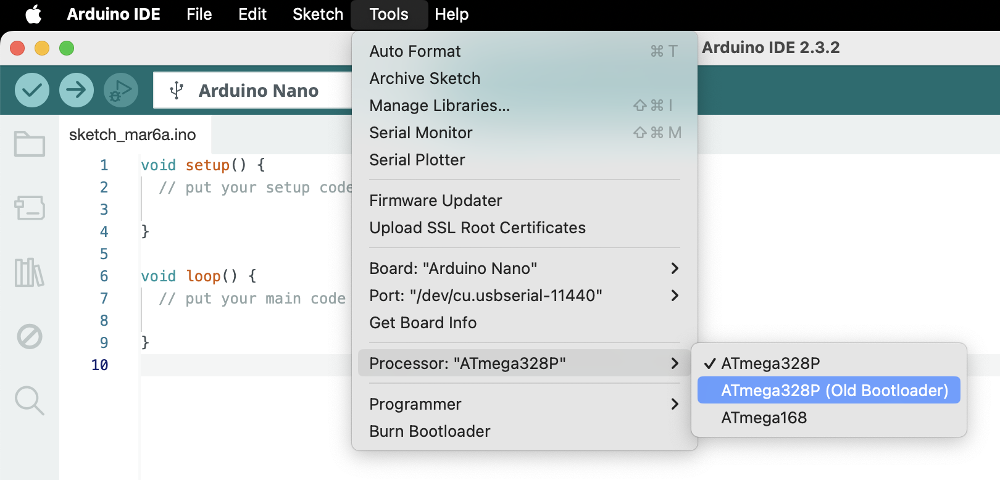

Then try upload again and it should upload without error.

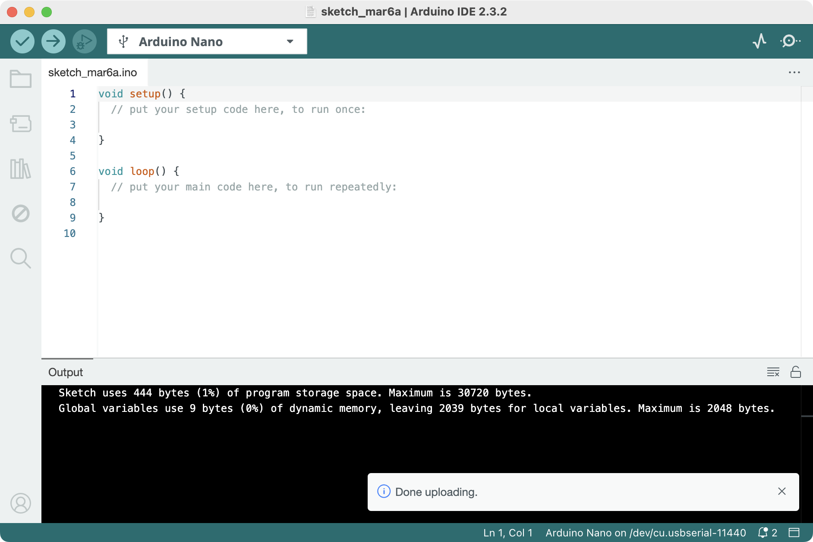

### *Other Common Issues/Troubleshooting:*

* Try different USB cable
* Try different USB port, avoid using adapters
* Try peer's Arduino

If there is other Arduino setting up issues, feel free to contact us.

### General Info and Tips about using Arduino in PHYS2020 Project

You might find the following Arduino Pin layout helpful (available at https://content.arduino.cc/assets/Pinout-NANO_latest.pdf). 

* If you want to power the Arduino without connecting it to a computer, you can uses either
    * 6-20V unregulated external power supply (pin 30 VIN) e.g. a 9V battery.
    * 5V regulated external power supply (pin 27 +5V) e.g. provided breadboard power supply, you might prefer this if you want to use some high current modules such as a display. 
    * The power source is automatically selected to the highest voltage source. 
* In general disconnect ant unused components from the Arduino pin, some Arduino libraries will hardcode specific pins and send current through without warning. 
* Becareful about which voltage rail you are connecting the modules! Some module come with a built-in voltage regulator so you can connect them to either 3.3V or 5V, while some modules doesn't and have to be connected to 3.3V, otherwise they could be permanentally damaged. 
* You probably should test each of your sensors and make sure they are up to the manufacture's claims before quoting their measurements in a scientific way, e.g. know their precision, measurement range, systematic error, response time. 
* [Arduino Official Documentation](https://docs.arduino.cc) and [Arduino Offical Forum](https://forum.arduino.cc) are usually good first places to look up for any issues.
* https://lastminuteengineers.com/electronics/arduino-projects/ provide extensive and detailed guide on Arduino modules, I strongly recommand a quick read to be familar of what's on there, espically if you want to go beyond the sample codes. (I've also stolen some figures from their website for educational purposes).

## MAX6675 (or MAX31855) Temperature Sensor

For more detailed guide on using the MAX6675 module, please read https://lastminuteengineers.com/max6675-thermocouple-arduino-tutorial/ 

The MAX31855 is the newer version MAX6675, but they work basically the same.

The kit includes 

* Type-K thermocouple probe 
    * M6 threads
    * measurement range 0-80ºC. TBC!
* MAX6675 breakout board, 
    * 12-bit ADC (analog to digical converter), 
    * temperature range 0-1024ºC with resolution of 0.25ºC (12-bit)
    * accuracy ±3ºC (however in my experience seen ±10ºC errors, so please check your probe is not faulty). 

The following table are the connections used in the sample code: 

| MAX6675                                                | Arduino    |
| ------------------------------------------------------ | ---------- |
| VCC                                                    | 3.3V or 5V |
| GND                                                    | GND        |
| SCK (Serial Clock for synchronising data transmission) | D6         |
| CS (Chip Select pin)                                   | D5         |
| SO (Serial data Out)                                   | D4         |

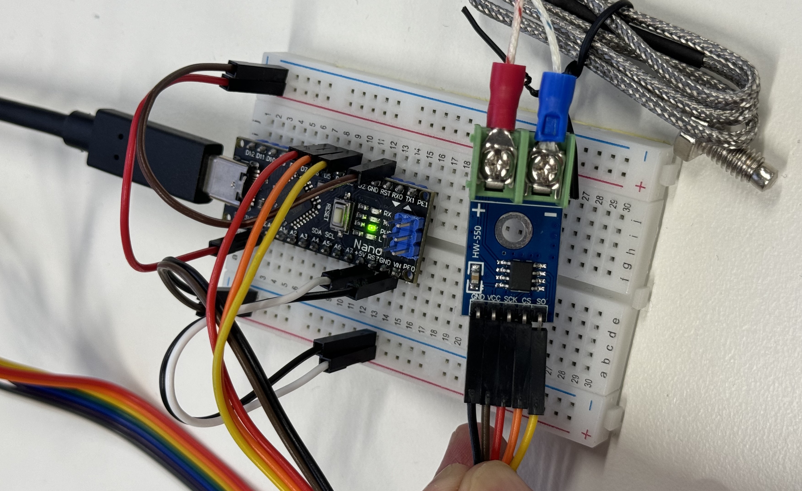

You also need to grab a code library to use MAX6675 module, go to `Menu -> Sketch -> Include Library -> Manage Libraries ` (or `Shift-Cmd-I` or click on the Library icon in left side bar), and search up `MAX6675`.
I used the official library from Adafruit, but you're of course welcome to experiment with other ones. 

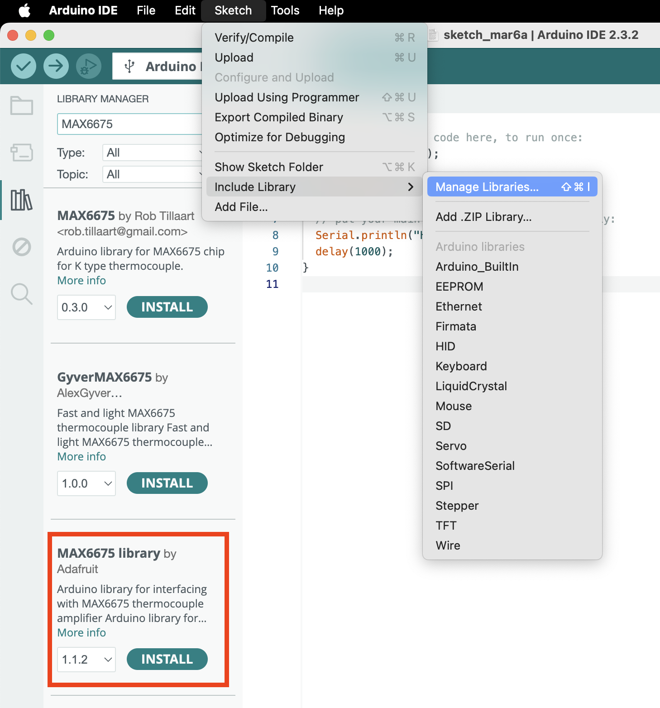

Once the library is installed, open the provided sample code at `Menu -> File -> Examples -> MAX6675 library -> serialthermocouple` , there's also a copy of it named `MAX6675SerialLogger.ino` in this repository.

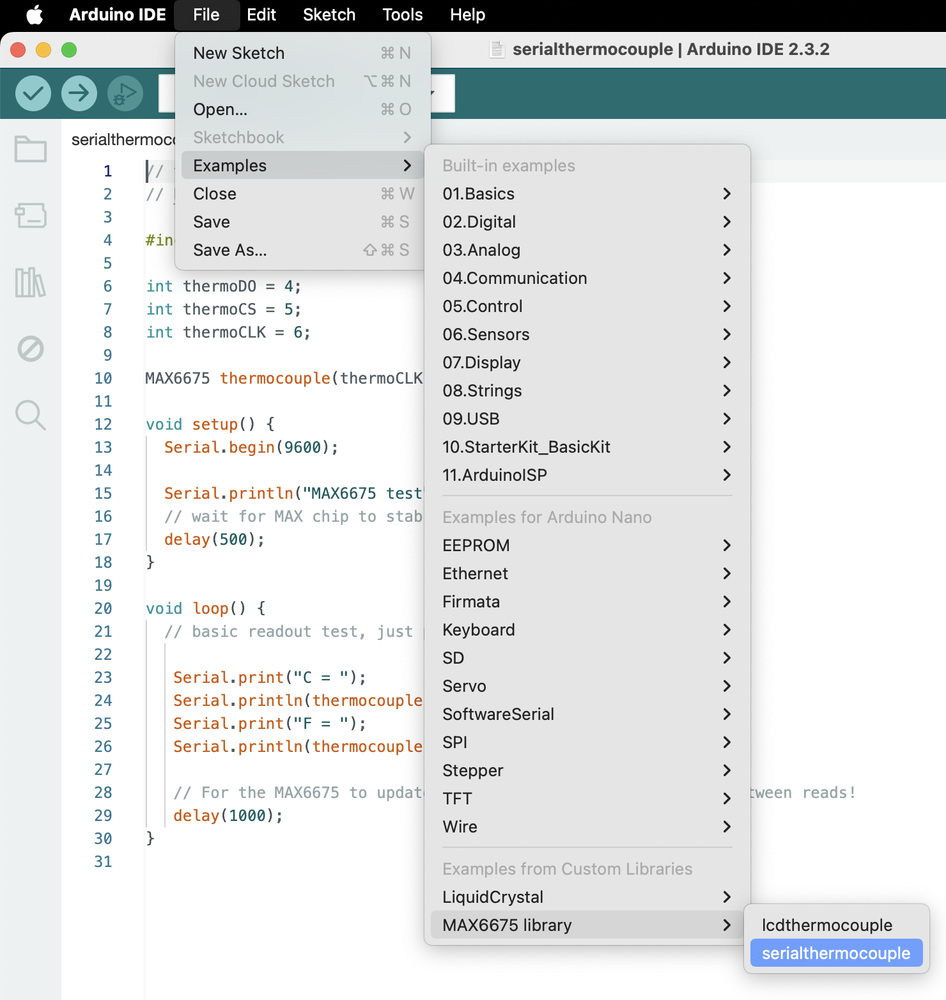

Try upload their sample script and open serial monitor (`Menu -> Tools -> Serial Monitor` or `Shift-Cmd-M` or the top right Magnifing glass icon) you should see the thermocouple printing the temperatures onto the Serial Monitor. You could also show their timestamps by toggling the clock icon on the right. 

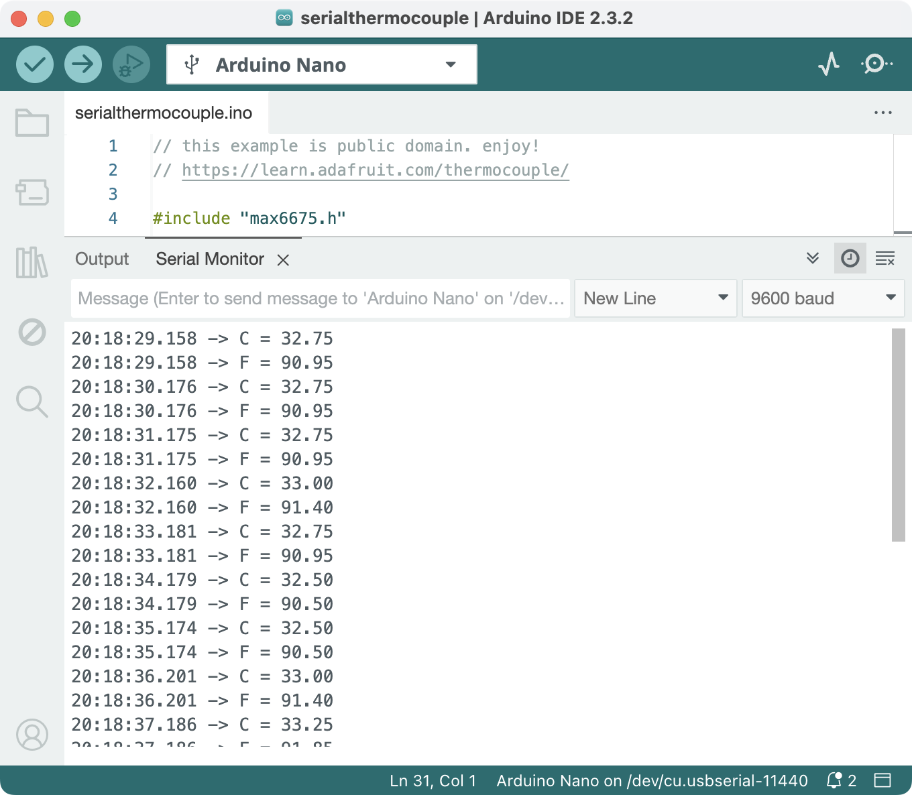

### Tips & Tricks

* If you want to use multiple MAX6675 (or MAX31855) you can (should) let them share the same SO and CLK pins, and only need connect different CS pins to Arduino. 

## DS18B20 Temperature Sensor

For more detailed guide on using the MAX6675 module, please read https://lastminuteengineers.com/ds18b20-arduino-tutorial/ .

We provide the DS18B20 sensor that comes in the waterproof probe. You also need a 4.7kΩ resistor between VCC and DQ. 

| DS18B20         | Arduino    |
| --------------- | ---------- |
| VCC             | 3.3V or 5V |
| GND             | GND        |
| DQ (Data Queue) | D2         |

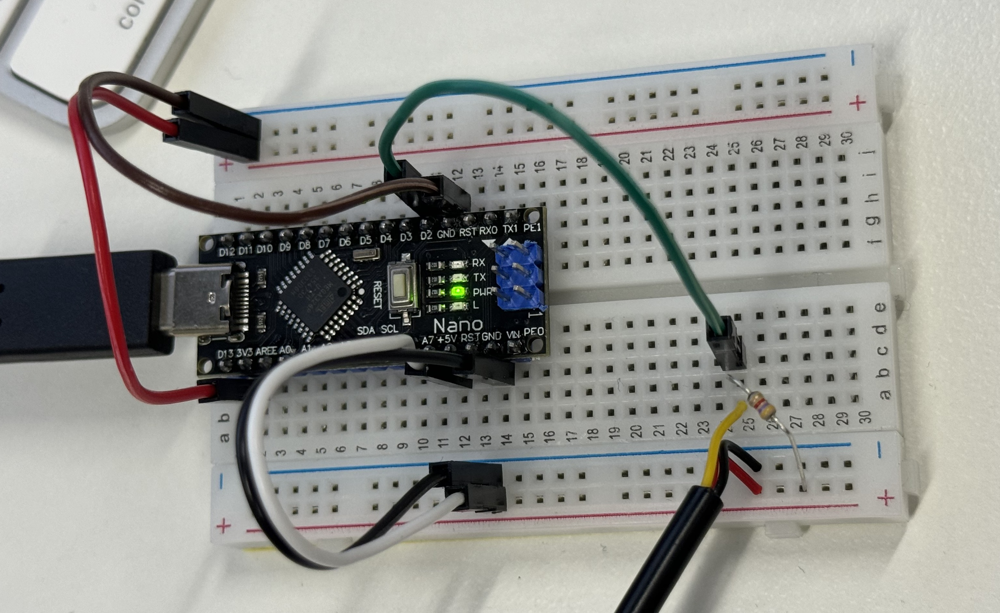

You also need to grab a code library to use DS18B20 module, go to `Menu -> Sketch -> Include Library -> Manage Libraries ` (or `Shift-Cmd-I` or click on the Library icon in left side bar), and search up `DS18B20`.
I used the official library from `DallasTemperature`, but you're of course welcome to experiment with other ones. 

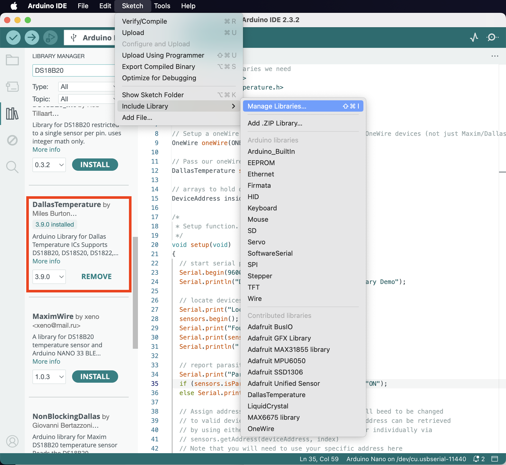

Once the library is installed, open the provided sample code at `Menu -> File -> Examples -> DallasTemperatures -> Single` , there's also a copy of it named `DS18B20Simple.ino` in this repository.

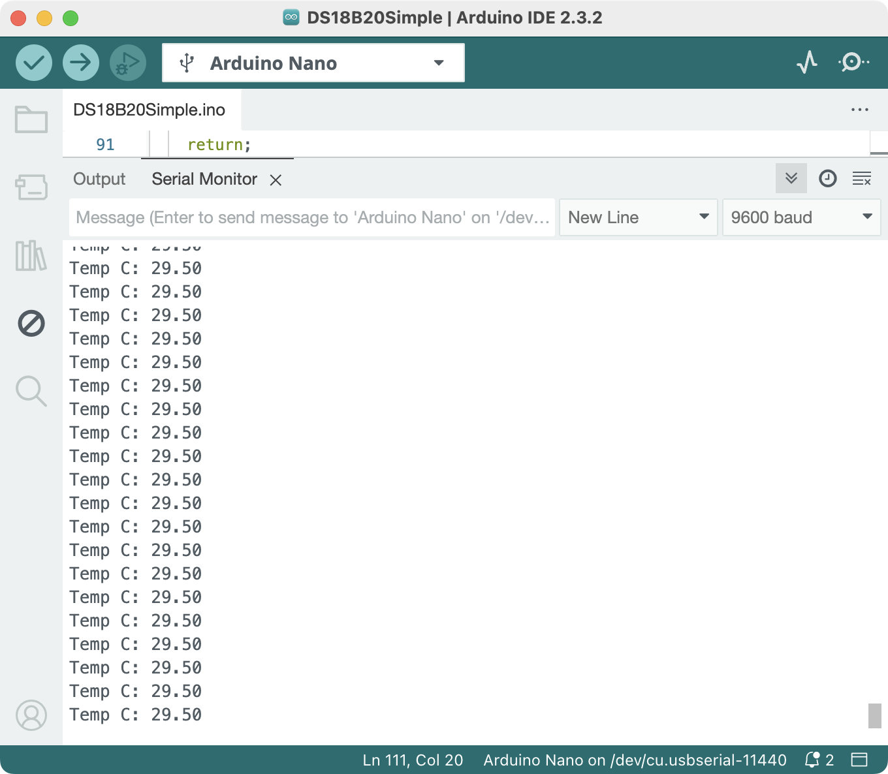

Try upload their sample script and open serial monitor (`Menu -> Tools -> Serial Monitor` or `Shift-Cmd-M` or the top right Magnifing glass icon) you should see the thermister printing the temperatures onto the Serial Monitor. You could also show their timestamps by toggling the clock icon on the right. 

### DS18B20 usage notes

* Since this sensor only require a single pin connection to Arduino it is very easy to add multiple sensors, for more info: see `Menu -> File -> Examples -> DallasTemperatures -> TwoPin_DS18B29`. 
* The sensor wires could easily come loose on a breadboard, you should come up with some more permenant solution. 

## MPU6050 Accelerometer and Gyroscope

For more detailed guide on using the MPU6050 module, please read https://lastminuteengineers.com/mpu6050-accel-gyro-arduino-tutorial/.

You might need a bit of soldering skills to make the pins.

| MPU6050                   | Arduino    |
| ------------------------- | ---------- |
| VCC                       | 3.3V or 5V |
| GND                       | GND        |
| SCL (Serial Clock Line)   | A5 (SCL)   |
| SDA (Serial Data Line)    | A4 (SDA)   |
| Other pins not connected. |            |

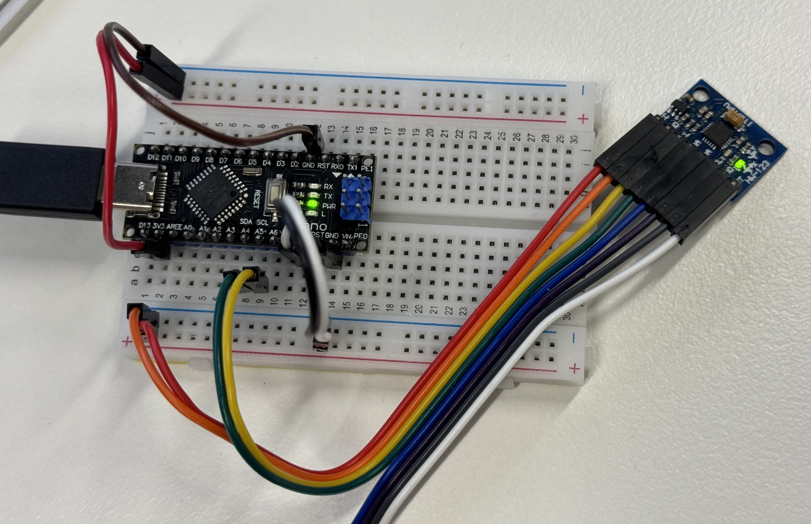

You also need to grab a code library to use DS18B20 module, go to `Menu -> Sketch -> Include Library -> Manage Libraries ` (or `Shift-Cmd-I` or click on the Library icon in left side bar), and search up `MPU6050`.

I used the official library of `Adafruit`, but you're of course welcome to experiment with other ones. 

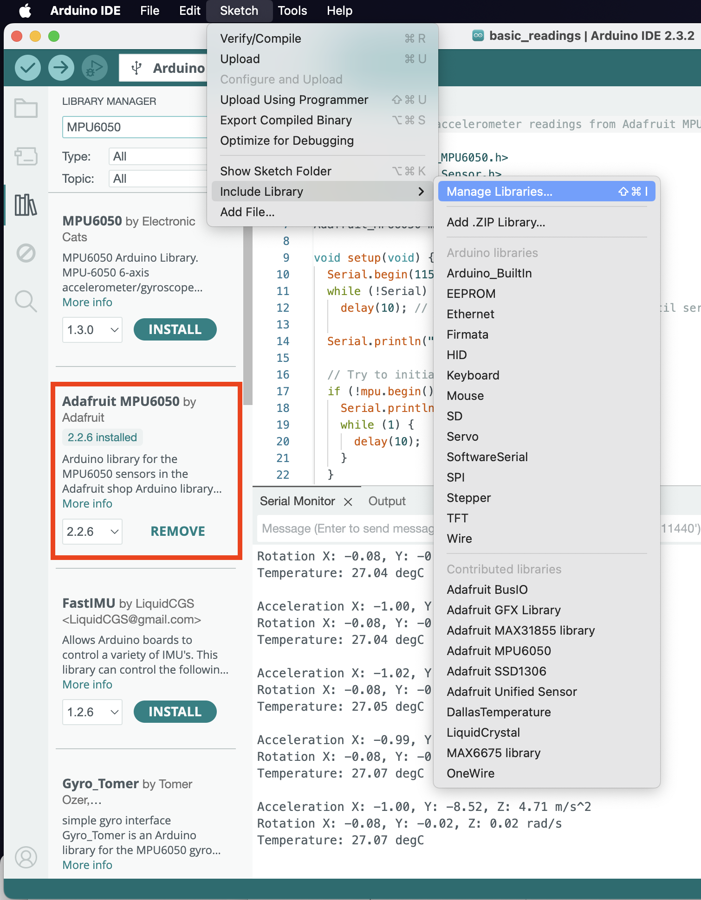

Once the library is installed, open the provided sample code at `Menu -> File -> Examples -> Adafruit MPU6050 -> basic readings` , there's also a copy of it named `MPU6050Basic.ino` in this repository.

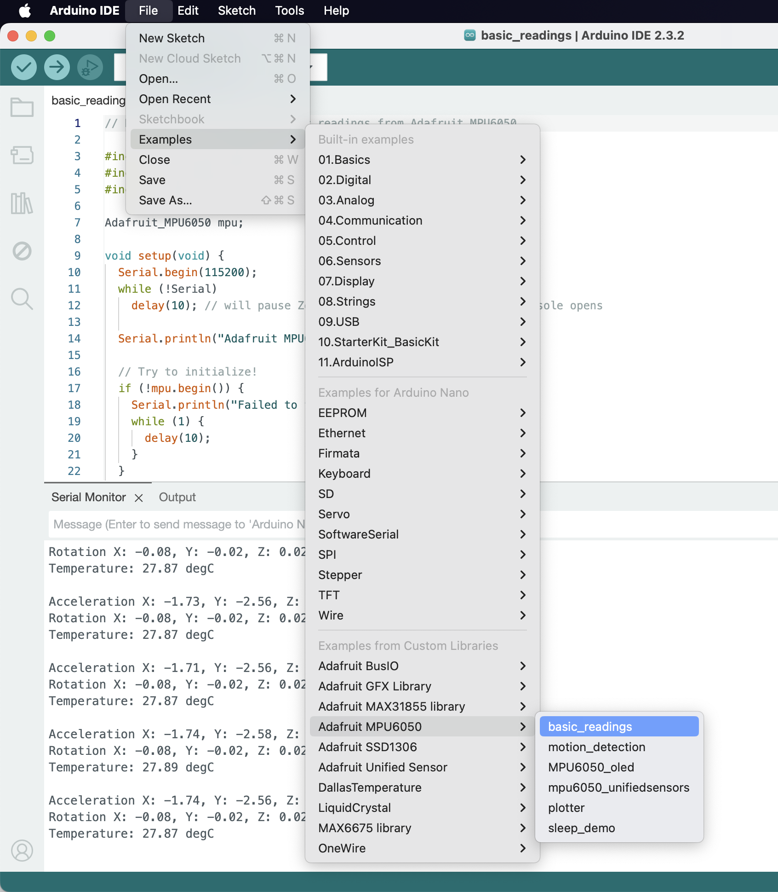

Try upload their sample script and open serial monitor (`Menu -> Tools -> Serial Monitor` or `Shift-Cmd-M` or the top right Magnifing glass icon). The sample codes uses 115200 serial baud rate (instead of the default 9600), so you need to manually select the baud rate in serial monitor. Then you should see it printing the sensors values onto the Serial Monitor. You could also show their timestamps by toggling the clock icon on the right. 

You could also try the script in `Menu -> File -> Examples -> Adafruit MPU6050 -> plotter` and use the Serial Plotter (top right oscilloscope icon) to get a real time plot from the accelerometer and gyroscope.

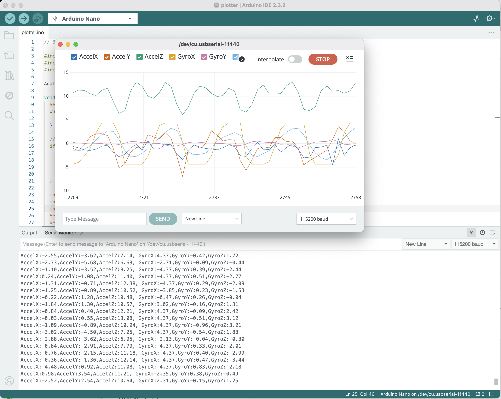

## Pressure Sensor

Depending on your sensor type, usually they only need ground and 5V, then the sensor output 0-5V depending on their spec. Then any Arduino's analog pin can read that 0-5V in 1024 steps using `analogRead(pinNo)`. 

* Thus, if for example your pressure sensor range is 0-5PSI, then 0-5Psi will correspond to 0-5V output, and your precision is 0.001 PSI. 
* You would need to test yoru pressure sensor carefully and make sure they are up to spec. 

## Recording Data to SD Card

For more detailed guide on using the SD card module, please read https://lastminuteengineers.com/arduino-micro-sd-card-module-tutorial/

| microSD Card Module                       | Arduino    |
| ----------------------------------------- | ---------- |
| VCC                                       | 3.3V or 5V |
| GND                                       | GND        |
| MISO (Serial Peripheral Interface Output) | 12         |
| MOSI (Serial Peripheral Interface Input)  | 11         |
| SCK (Serial Clock)                        | 13         |
| CS (Chip Select)                          | 10         |

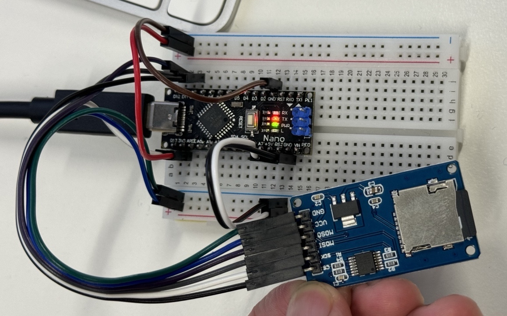

Open the built in sample code at `Menu -> File -> Examples -> SD -> CardInfo` , and change the value of `chipSelect`  at `line 36` to `10`, then upload the code onto Arduino, you should get the following info from the provided SD card (your's might not show any files found, I have some files from macOS filesystem crap). 

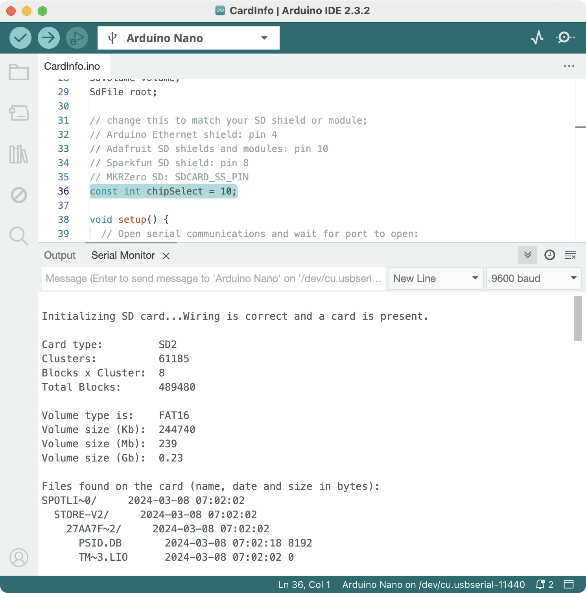

