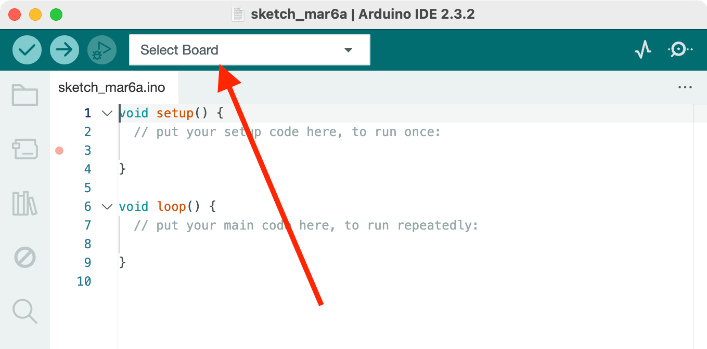
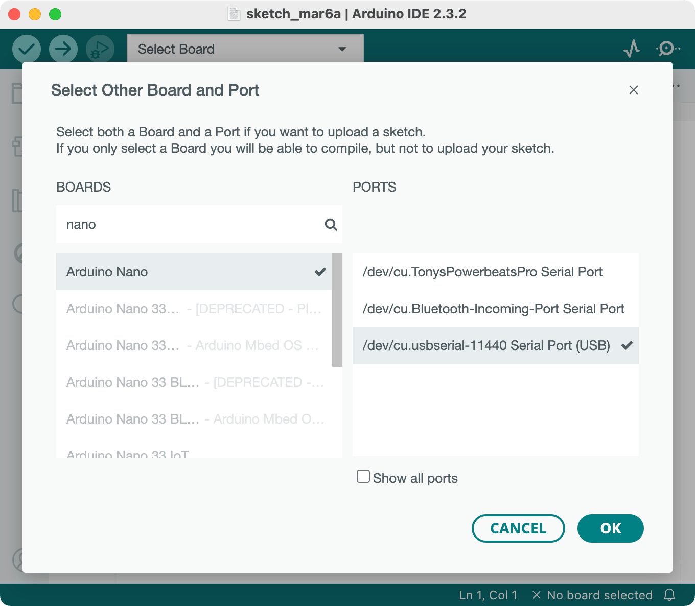
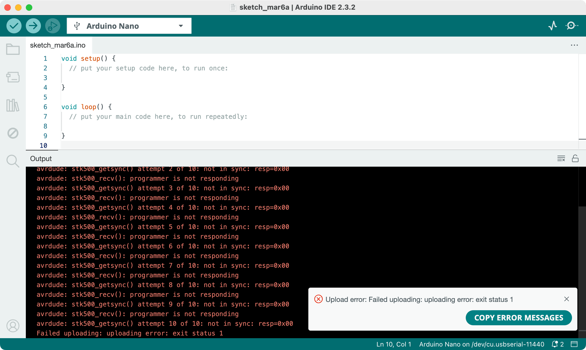
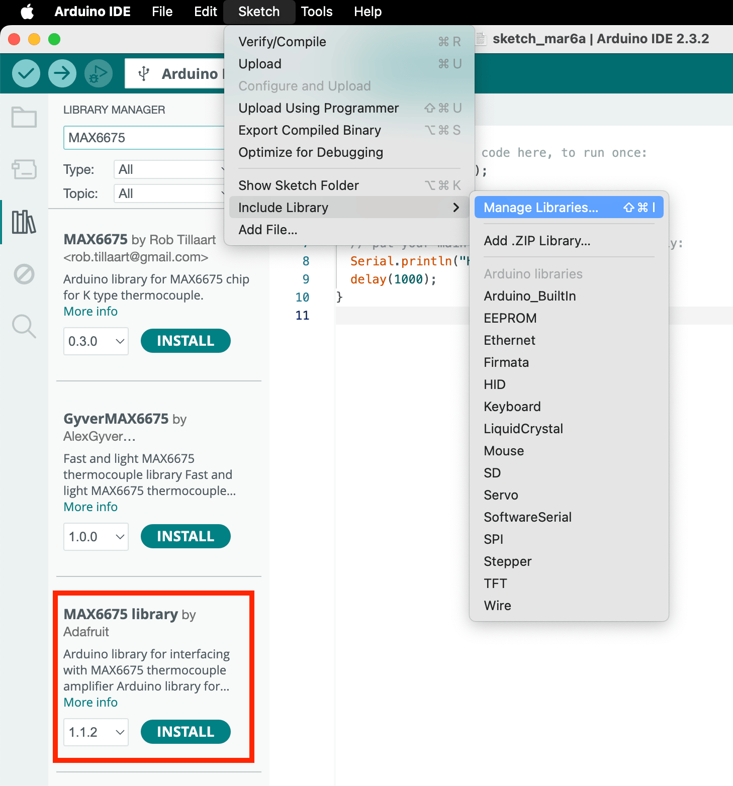
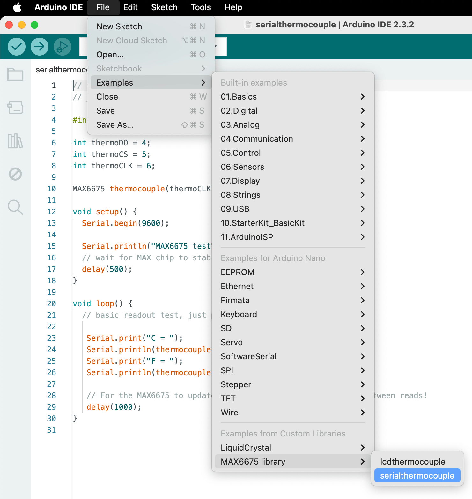
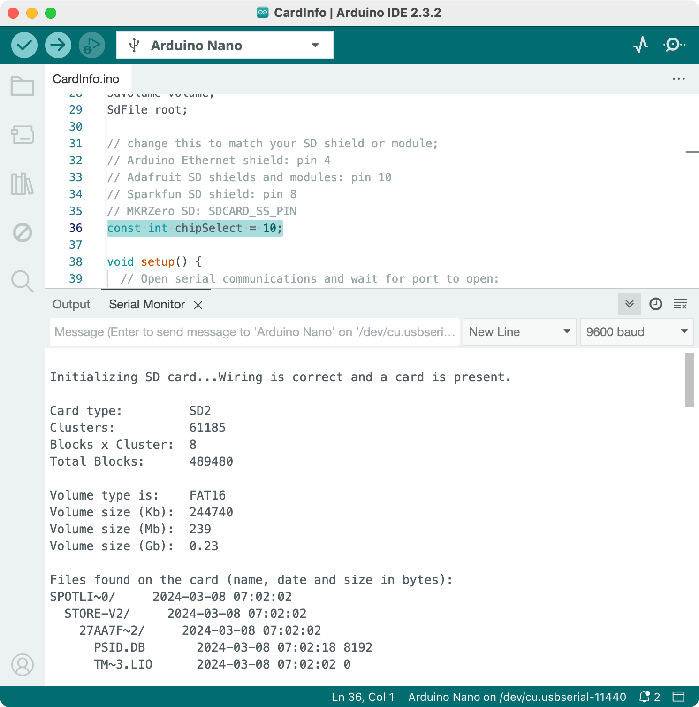

# ANU PHYS2020 Thermodynamics Course Arduino Quick Start Guide

Tony.Yan @anu.edu.au

March 2024

[](https://github.com/TonyXTYan/PHYS2020-Arduino-Quick-Start/releases/latest)


------
* TOC
{:toc}
------ 

* *This is a guide for setting up an Arduino for data logging.*
* *You can download all the source code from [releases](https://github.com/TonyXTYan/PHYS2020-Arduino-Quick-Start/releases)*
* *The sample code performs basic data logging of provided components. We encourage you to extend and customise it to your project-specific needs.*
* *Make sure to double-check any pin connections before powering on, even though Arduino has some built-in protections, it's still possible to fry something...*
* *Begin by completing the [Connecting to Arduino](#connecting-to-arduino), followed by the section about your specific sensors. Then you could proceed to [Recording Data to SD Card](#Recording-Data-to-SD-Card).*
* *Note: the sensor sections from this guide are TLDR versions from [Last Minute Engineers](https://lastminuteengineers.com/electronics/arduino-projects/ ), with some pin changes to integrate the SD card module. You're of course welcome to explore more.*
* *For reference: I’m using macOS 14.4, Apple Silicon, Arduino IDE 2.3.2, Arduino Nano and various electronics modules from Adrian.*


------


## Connecting to Arduino

First, download Arduino IDE (integrated development environment) from https://www.arduino.cc/en/software. 

Once you have the Arduino IDE installed, we need to verify that the Arduino works by connecting it to your computer and the IDE. 

As illustrated in the figure below, I also strongly recommend mounting your Arduino Nano onto a breadboard and connecting the 5V and 3.3V to each power rail on the breadboard. This makes connecting various modules much simpler later.  


As a side note, breadboards internally are connected like follows, 

So you can have 3.3V power rails on the top and another 5V rails on the bottom. 
Note, these 5V and 3.3V are regulated by Arduino internal components, you can use them to power a few chips. But when powering lots of modules or a display, I suggest using the breadboard power supply (picture below and Adrian should have some on requests). If you decide to use one of these, make sure you set the jumper pins correctly, i.e. don't connect the 5V power supply to the 3.3V pin on Arduino, [you may fry it](https://forum.arduino.cc/t/accidentally-applied-5v-supply-to-3-3v-pin-something-smoked-what-was-it/259012). 


Our Arduino Nano uses a USB Type-C connector; you can connect it to your computer with any Type-C cable and Arduino can be powered from Type-C. 

The Arduino IDE will preload a default BareMinimum script (`Menu -> File -> Examples -> Basic -> BareMinimum`) so you can test your connections to your Arduino.

Configure the IDE to our specific Arduino by clicking `Select Board`



Select `Arduino Nano` and its `USB Serial Port`. 



Then, you can try uploading the BareMinimum script onto your Arduino by pressing the `Upload` icon (or `Menu -> Sketch -> Upload` or `Cmd-U`). 


You might experience the following error saying the programmer is not in sync



In that case, you need to go to Menu -> Tools -> Processor and select: **ATmega328P (Old Bootloader)**


Then try upload again and it should upload without error.


### *Other Common Issues/Troubleshooting:*

* Try different USB cable
* Try different USB ports, avoid using adapters
* Try peer's Arduino

If there are other Arduino setting-up issues, feel free to contact us.

### General Info and Tips about using Arduino in PHYS2020 Project

You might find the following Arduino Pin layout helpful (available at https://content.arduino.cc/assets/Pinout-NANO_latest.pdf). 


* If you want to power the Arduino without connecting it to a computer, you can use either
    * 6-20V unregulated external power supply (pin 30 **VIN**), e.g. a 9V battery.
    * 5V regulated external power supply (pin 27 **+5V**). e.g. provided breadboard power supply, you might prefer this if you want to use some high current modules such as a display. 
    * The power source is automatically selected as the highest voltage source. 
* In general, disconnect all unused components from the Arduino pin. Some Arduino libraries will hardcode specific pins and send current through without warning. 
* Be careful about which voltage rail you connect the modules to! Some modules come with a built-in voltage regulator, so you can connect them to either 3.3V or 5V, while some don't and have to be connected to 3.3V; otherwise, they could get permanently damaged. 
* You should probably test each of your sensors and make sure they meet the manufacturer's claims before quoting their measurements scientifically, e.g., knowing their precision, measurement range, systematic error, and response time. 
* AI & LLM are fantastic at generating Arduino code and general Q&A, just make sure you understand every line it generates before uploading to Arduino, especially the physical pin connections match the code. Hint: [GitHub Copilot](https://docs.github.com/en/copilot/managing-copilot/managing-copilot-as-an-individual-subscriber/getting-started-with-copilot-on-your-personal-account/getting-free-access-to-copilot-pro-as-a-student-teacher-or-maintainer) offers many most advanced AI models for free to education accounts.
* I strongly recommend some kind of version control of your code and you can include the version histories as part of your final submission. I mostly use [Git](https://git-scm.com/book/en/v2/Getting-Started-What-is-Git%3F) hosted on [GitHub](https://docs.github.com/en/get-started/start-your-journey/about-github-and-git), there are also [GitLab](https://docs.gitlab.com/tutorials/) and [ANU self-hosted GitLab](https://gitlab.cecs.anu.edu.au) (though I will *not* recommend the last one, it consistently crashes around the end of each semester).
* [Arduino Official Documentation](https://docs.arduino.cc) and [Arduino Offical Forum](https://forum.arduino.cc) are also good sources to look up for any issues.
* https://lastminuteengineers.com/electronics/arduino-projects/ provides extensive and detailed guides on Arduino modules. I strongly recommend reading them to understand the module you are using, especially if you want to go beyond the sample codes. (I've also stolen some figures from their website for educational purposes.)
  

## MAX6675 Temperature Sensor

For a more detailed guide on using the MAX6675 module, please read https://lastminuteengineers.com/max6675-thermocouple-arduino-tutorial/ 

The kit includes 

* Type-K thermocouple probe 
    * M6 threads
    * measurement range 0-80ºC. TBC!
* MAX6675 breakout board, 
    * 12-bit ADC (analog to digital converter), 
    * temperature range 0-1024ºC with resolution of 0.25ºC (12-bit)
    * accuracy ±3ºC (however, in my experience, I got ±10ºC errors, so please check your probe is not faulty). 

The following table shows the connections used in the sample code: 


| MAX6675                                                | Arduino    |
| ------------------------------------------------------ | ---------- |
| VCC                                                    | 3.3V or 5V |
| GND                                                    | GND        |
| SCK (Serial Clock for synchronising data transmission) | D6         |
| CS (Chip Select pin)                                   | D5         |
| SO (Serial data Out)                                   | D4         |


You also need to grab a code library to use the MAX6675 module. Go to `Menu -> Sketch -> Include Library -> Manage Libraries ` (or `Shift-Cmd-I` or click on the Library icon in the left sidebar) and search for `MAX6675`.
I used the official library from Adafruit, but you're of course welcome to experiment with other ones. 



Once the library is installed, open the provided sample code at `Menu -> File -> Examples -> MAX6675 library -> serialthermocouple`; there's also a copy of it named `MAX6675SerialLogger.ino` in this repository.



Try uploading their sample script and opening the serial monitor (`Menu -> Tools -> Serial Monitor` or `Shift-Cmd-M` or the top right Magnifying glass icon). You should see the thermocouple printing the temperatures onto the Serial Monitor. You could also show their timestamps by toggling the clock icon on the right. 


### Tips & Tricks

* If you want to use multiple MAX6675 (or MAX31855), you can (should) let them share the same SO and CLK pins and only connect different CS pins to the Arduino. 


## MAX31855
The MAX31855 is a newer version MAX6675, but they work basically the same (I haven't test & verify the this exact guide of MAX31855, if there is any issues please let me know). 


| MAX 31855 | MAX 6675 Equivalent | Arduino to MAX31855   | Sample code (`serialthermocouple`) variable |
| --------- | -------- | ---------- | ----------------- |
| Vin  (Power input)   | VCC      | 3.3V or 5V | -       |
| V3o (only connect one of V3o or Vin)       | -        | 3.3V       | -      |
| GND  (Ground)     | GND      | GND        | -       | 
| CLK  (Serial Clock)            | SCK      | D5         | `MAXCLK` |
| CS    (Chip Select)            | CS       | D4         | `MAXCS` |
| SO/DO    (Serial Data out)     | SO       | D3         | `MAXSO` |

You'll need to go to `Side bar -> Library Manager` (or `Cmd-Shift-I`, or `Menu -> Sketch -> Include Library -> Manage Libraries`), and search for `Max31855` and install the library by `Adafruit` (feel free to experiemnt libraries published by others). 
 
Once the library is installed, open the provided sample code at `Menu -> File -> Examples -> Adafruit MAX31855 -> serialthermocouple`; there's also a copy of it named `MAX31855SerialLogger.ino` in this repository.

Try uploading their sample script and opening the serial monitor (`Menu -> Tools -> Serial Monitor` or `Shift-Cmd-M` or the top right Magnifying glass icon). You should see the thermocouple printing the temperatures onto the Serial Monitor. You could also show their timestamps by toggling the clock icon on the right. 

### Tips & Tricks
* If you want to use multiple MAX31855, you should let them share the same `DO` and `CLK` pins physically on the Arduino and give them the same `MAXDO` and `MAXCLK` variables in the code. Then, you can connect different `CS` pins to the Arduino, and assign them to different `MAXCS` in the code. This way, you can free up some pins and connect to other sensors or modules. Below is an example implementation of multiple MAX31855s. 
```c++
#define MAXDO 2
#define MAXCLK 3
#define MAXCS1 4
Arduino_MAX31855 thermocouple1(MAXCLK, MAXCS1, MAXDO);
#define MAXCS2 5
Arduino_MAX31855 thermocouple2(MAXCLK, MAXCS2, MAXDO);
...
```


## DS18B20 Temperature Sensor

For a more detailed guide on using the DS18B20 module, please read https://lastminuteengineers.com/ds18b20-arduino-tutorial/ .

We provide the DS18B20 sensor that comes in the waterproof probe. You also need a 4.7kΩ resistor between VCC and DQ. 


| DS18B20         | Arduino    |
| --------------- | ---------- |
| VCC             | 3.3V or 5V |
| GND             | GND        |
| DQ (Data Queue) | D2         |


You also need to grab a code library to use the DS18B20 module. Go to `Menu -> Sketch -> Include Library -> Manage Libraries ` (or `Shift-Cmd-I` or click on the Library icon in the left sidebar) and search for `DS18B20`.
I used the official library from `DallasTemperature`, but you're of course welcome to experiment with other ones. 


Once the library is installed, open the provided sample code at `Menu -> File -> Examples -> DallasTemperatures -> Single`; there's also a copy of it named `DS18B20Simple.ino` in this repository.


Try uploading their sample script and opening the serial monitor (`Menu -> Tools -> Serial Monitor` or `Shift-Cmd-M` or the top right Magnifying glass icon). You should see the thermometer printing the temperatures onto the Serial Monitor. You could also show their timestamps by toggling the clock icon on the right. 


### DS18B20 usage notes

* Since this sensor only requires a single-pin connection to Arduino, it is straightforward to add multiple sensors; for more info, see `Menu -> File -> Examples -> DallasTemperatures -> TwoPin_DS18B29`. 
* The sensor wires could easily come loose on a breadboard; you should come up with a more permanent solution. 


## MPU6050 Accelerometer and Gyroscope

For a more detailed guide on using the MPU6050 module, please read https://lastminuteengineers.com/mpu6050-accel-gyro-arduino-tutorial/.

You might need soldering skills to make the pins.

<!--  -->


| MPU6050                   | Arduino    |
| ------------------------- | ---------- |
| VCC                       | 3.3V or 5V |
| GND                       | GND        |
| SCL (Serial Clock Line)   | A5 (SCL)   |
| SDA (Serial Data Line)    | A4 (SDA)   |
| Other pins not connected. |            |


You also need to grab a code library to use the MPU6050 module, go to `Menu -> Sketch -> Include Library -> Manage Libraries ` (or `Shift-Cmd-I` or click on the Library icon in the left sidebar), and search up `MPU6050`.

I used the official library of `Adafruit`, but you're of course welcome to experiment with other ones. 


Once the library is installed, open the provided sample code at `Menu -> File -> Examples -> Adafruit MPU6050 -> basic readings`; there's also a copy of it named `MPU6050Basic.ino` in this repository.


Try uploading their sample script and opening the serial monitor (`Menu -> Tools -> Serial Monitor` or `Shift-Cmd-M` or the top right Magnifying glass icon). The sample codes use 115200 serial baud rate (instead of the default 9600), so you need to manually select the baud rate in the serial monitor. Then, you should see it printing the sensors' values onto the Serial Monitor. You could also show their timestamps by toggling the clock icon on the right. 

You could also try the script in `Menu -> File -> Examples -> Adafruit MPU6050 -> plotter` and use the Serial Plotter (top right oscilloscope icon) to get a realtime plot from the accelerometer and gyroscope.


### Notes

* MPU6050 has programming sensor range and higher range means lower sensitivity, this is set by `mpu.setAccelerometerRange(MPU6050_RANGE_8_G)` and `mpu.setGyroRange(MPU6050_RANGE_500_DEG)`. For example, if you choose maximum acceleration of $2g$, then you maximum sensitivity is $\frac{1}{16384}g \approx 0.6 \mathrm{mm/s^2}$, while max acc set to $16g$ would have sensitivity of $\frac{1}{2048}g\approx 4.8\mathrm{mm/s^2}$. More details about this is available on their datasheet https://invensense.tdk.com/wp-content/uploads/2015/02/MPU-6000-Datasheet1.pdf

## Pressure Sensor

Depending on your sensor type, usually, they only need ground and 5V, then the sensor output 0-5V depending on their spec. Then any Arduino's analog pin can read that 0-5V in 1024 steps using `analogRead(pinNo)`. 

* Thus, if for example your pressure sensor range is 0-5PSI, then 0-5Psi will correspond to 0-5V output, and your precision is 0.001 PSI. 
* You would need to test your pressure sensors carefully and make sure they are up to spec. 
* The pressure sensor in the template data logger (`SDCardDataLogger.ino`) is connected to analog pin A1. 

## Recording Data to SD Card

For a more detailed guide on using the SD card module, please read https://lastminuteengineers.com/arduino-micro-sd-card-module-tutorial/


For the SD card module to work with the sample code (`SDCardDataLogger.ino`), connect the pins as follows, 


| microSD Card Module                       | Arduino    |
| ----------------------------------------- | ---------- |
| VCC                                       | 3.3V or 5V |
| GND                                       | GND        |
| MISO (Serial Peripheral Interface Output) | 12         |
| MOSI (Serial Peripheral Interface Input)  | 11         |
| SCK (Serial Clock)                        | 13         |
| CS (Chip Select)                          | 10         |


### Verify your SD card and reader module works

Open the built-in sample code at `Menu -> File -> Examples -> SD -> CardInfo` , and change the value of `chipSelect`  at `line 36` to `10`, then upload the code onto Arduino, you should get the following info from the provided SD card (your's probably will not show any files, I have some files from macOS filesystem crap). 



### Using the sample code

Unless you installed all the sensors mentioned in the exact pins (in pic below), the sample code `SDCardDataLogger.ino` would most likely throw some errors and complain about missing sensors. 


If you do have all sensors installed, then `SDCardDataLogger.ino` would log data to both the SD card and Serial Monitor, and it could also log data to the SD card without connecting it to a computer. The Serial monitor output would look something like this: 

```csv
MPU6050 Initialised.
Initialising SD card...done.
Logging to: log20.csv
Tms,423,Acc,-3.10,3.44,-8.87,Rot,-0.08,-0.01,0.02,V1,0.01,TC,0.00,TS,25.00,
Tms,557,Acc,-3.09,3.45,-8.88,Rot,-0.08,-0.02,0.02,V1,0.01,TC,0.00,TS,25.00,
Tms,690,Acc,-3.11,3.47,-8.85,Rot,-0.08,-0.02,0.02,V1,0.00,TC,0.00,TS,25.00,
...
...
```

The first three lines are just checking setup; from the fourth line onwards, they show the exact data logged to the SD card. 

* `Tms` is milliseconds since Arduino boot.
* `Acc` shows x,y,z acceleration (m/s^2) and `Rot` shows xyz rotation (rad/s) using MPU6050
* `V1` is the voltage from analog pin A1 for the pressure sensor. Depending on your pressure gauge spec, you need to convert this value to pressure.
* `TC` is MAX6675 thermocouple reading in C. (It's showing zero cuz I might have accidentally blown mine)
* `TS` is DS18B20 temperature sensor in C.

The data are logged in CSV (comma separated value) format which can be easily read by [Mathematica](https://reference.wolfram.com/language/ref/format/CSV.html), [Python](https://pandas.pydata.org/pandas-docs/stable/reference/api/pandas.read_csv.html), [Excel](https://support.microsoft.com/en-au/office/import-or-export-text-txt-or-csv-files-5250ac4c-663c-47ce-937b-339e391393ba) or your preferred stats tool. 

You should **comment out (`Cmd-/`) any code about the sensors that you are *not* using**. 

* Code about MAX6675: 

  ```c++
  // Line 13-14
  // MAX6675 Thermocouple
  #include "max6675.h"
  MAX6675 thermocouple(6, 5, 4); // SCK - pin 6, CS - pin 5, SO - pin 4.
  ...
  // Line 102-104
  // MAX6675
  logToSerialAndSD("TC");  
  logToSerialAndSD(thermocouple.readCelsius()); 
  ```
* Code about MAX31855 (**untested!**)

  ```c++
  // Line 16-18
  // MAX31855 Thermocouple
  #include <MAX31855.h>
  MAX31855 thermocouple2(MAXCLK, MAXCS, MAXSO);
  ...
  // Line 106-108
  // MAX31855
  logToSerialAndSD("TC");
  logToSerialAndSD(thermocouple2.readCelsius());
  ```

* Code about DS18B20

    ```c++
    // Line 20-24
    // DS18B20 Temperature Sensor 
    #include <OneWire.h>
    #include <DallasTemperature.h>
    OneWire oneWire(2);         // setup a oneWire with DS18B20 DQ connected to pin 2 
    DallasTemperature tempSensor(&oneWire); // pass oneWire to DallasTemperature library
    ...
    // Line 110-113
    // DS18B20
    tempSensor.requestTemperatures(); // send the command to get temperatures 
    logToSerialAndSD("TS");
    logToSerialAndSD(tempSensor.getTempCByIndex(0));
    ```

* Code about MPU6050

    ```c++
    // Line 27-31
    // MPU6050 Accelerometer and Gyroscope
    #include <Adafruit_MPU6050.h>
    #include <Adafruit_Sensor.h>
    #include <Wire.h>
    Adafruit_MPU6050 mpu;
    ...
    // Lines 85-95
    // MPU6050 
    sensors_event_t a, g, temp; // Get new sensor events with the readings
    mpu.getEvent(&a, &g, &temp);
    logToSerialAndSD("Acc");
    logToSerialAndSD(a.acceleration.x);
    logToSerialAndSD(a.acceleration.y);
    logToSerialAndSD(a.acceleration.z);
    logToSerialAndSD("Rot");
    logToSerialAndSD(g.gyro.x);
    logToSerialAndSD(g.gyro.y);
    logToSerialAndSD(g.gyro.z);
    ```

* Code about pressure sensor

    ```c++
    // Lines 98-100
    // Pressure Sensor at Analog pin A1 
    logToSerialAndSD("V1");
    logToSerialAndSD(analogRead(A1)*5.0/1024.0);
    ```


#### Other things to consider

* `SDCardDataLogger.ino` will dump data onto SD immediately after the Arduino is powered, and the only way to stop is to power down the Arduino. Consider adding a push button to start and stop recording. 
* Arduino doesn't have a built-in real-time clock, only an internal timer to count the time from boot. So the only labels for which recording are their file names. You should think about how to organise your data files. 
* My quick test shows this logs data at about 40kB/min, which a 256MB SD card will take a few days to fill up. 
* Arduino Nano has a built-in reset button. If you press it once, Arduino will restart and automatically run `SDCardDataLogger.ino`, creating a new file and recording. 


